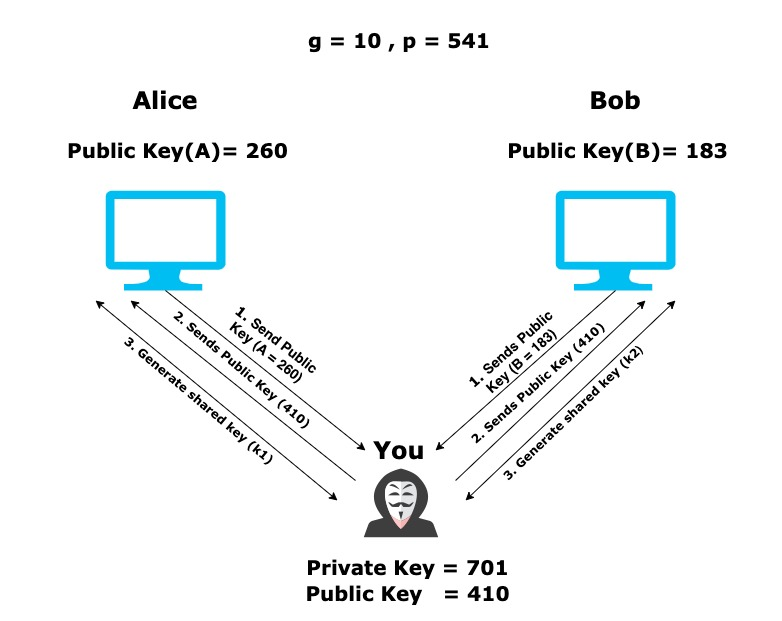

Recently i had participated in Lakshya-CTF where the DH-MITM was a challenge so first we were presented with the message 
```
Diffie–Hellman is pretty secure. But, when it comes to the man-in-the-middle attack, problems arise. You (attacker) are conducting the man-in-the-middle attack. You generate shared keys with both A and B. Using this shared key, A and B send you two ciphertexts (encrypted using AES 128 bit key) dYGU3Bzxhz6cpmB++E6wrRzzYk2IFsc8w5rk5ARsrXI= and LzldIUuFTY+k4GG4brJRqQ==. Decrypt the data from each party, to get the flag.
```




So as we have seen in the explanation of that Rick and morty had to establish the channel so the same is happening here the attacker will generate the shared secret k1 and k2 via the public keys from  A and B and use g and p   for the purpose.

```
Given g=10 p=541

(10^pk1) mod 541 =260=A=pb1------->Attacker has A
410<------------------------------ Attacker sends (10^410) mod 541
ss1=(410^s1) mod 541  == (260^710) mod 541=ss2
```

Similarly this goes for for B


So for A shared secret ss2= (A^x mod)p = 260^701 mod541 = 424

   for B shared secret ss2= (B^x mod)p = 183^701 mod541 = 523

On deecoding aes-128(424,dYGU3Bzxhz6cpmB++E6wrRzzYk2IFsc8w5rk5ARsrXI=)--  lakshya_CTF{m4N_1n_tH3_
On deecoding aes-128(523,LzldIUuFTY+k4GG4brJRqQ==)                    --  m1Ddl3_4tt4ck}

So final flag was= lakshya_CTF{m4N_1n_tH3_m1Ddl3_4tt4ck}
