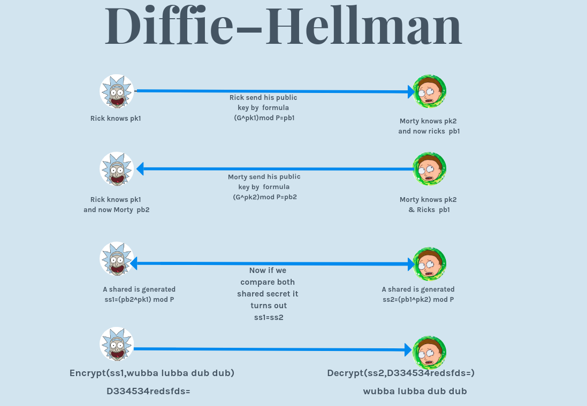

Diffie–Hellman is used as an encryption technique of generating a shared secret which then would be used for encrypting the message with that shared secret.So lets look how its done and also we will take an example used in a ctf.

Lets Suppose Rick and Morty wants to communicate over a public channel now first they will agree on a prime number P and a generator G. Now both Rick and Morty will have an private key here we will refrence it as pk1 & pk2.

To generate the shared key the process goes as in diagram:

Hence without actually sharing their secret keys they can communicate but there's a problem with this that it's vulnerable to Man In the middle Attack.So this is discused in this writeup/example

[Lakshya-CTF](https://github.com/TeamUnderdawgs/Crypto-For-CTFs/tree/master/Diffie-hellman/Lakshya-CTF)
 
 
 
 
 
 
 
 
 
 
 
 
